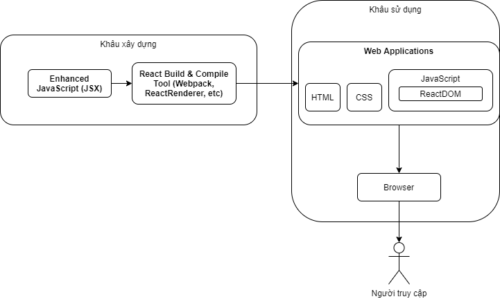

# Basic of React

## Background

- ở những bài trước, chúng ta đã học lần lượt qua những viên gạch nền tảng khi xây dựng các ứng dụng trên web (HTML, CSS, JS). Trong bài hôm nay, chúng ta sẽ đi vào tìm hiểu một bộ thư viện (Framework) kết hợp từ những viên gạch đó để hỗ trợ việc phát triển xây dựng ứng dụng phổ biến React

## Dụng cụ cần thiết (Pre-Requisite)

- Mọi hướng dẫn về cách cài đặt ứng dụng hiện được lưu trữ tại đây https://docs.google.com/spreadsheets/d/1ZR0JhasZGJJ88ngb8VqV6Lx06WLkDUwjpSIiEf6hUus/edit#gid=691196640
- Mọi câu hỏi về cài đặt vui lòng liên hệ với các mentor thân yêu để được giải đáp :)


### Windows

- Cần lưu ý một số chương trình ở đây cần cài đặt và sử dụng với quyền admin (PowerShell > Chuột phải > `Run as administrator`)

1. VisualStudio Code
2. Chocolatey
3. Git
4. NodeJS

### Mac

1. VisualStudio Code
2. Brew
3. Git
4. NodeJS

## Content

### React

#### Khái quát
- React là bộ thư viện với mã nguồn mở (viết bằng JavaScipt) được phát triển chủ yếu bởi Facebook. Bộ thư viện này giúp các lập trình viên xây dựng những ứng dụng (bao gồm cả trên web và di động) một cách nhanh, sạch và thân thiện

### Cấu trúc hoạt động

- Các lập trình viên thường sẽ xây dựng React thông qua JSX, một biến thể của JavaScript những với khả năng viết các tag như HTML vào trong đó
- Từ JSX được viết, Bộ thư viện React sẽ biên dịch thành HTML, CSS và JavaScript thông thường, giúp các trình duyệt có thể hiểu và hiển thị giao diện
  - Nhờ vào những quan niệm của React, một số các thư viện khác đã thành công trong việc biên dịch JSX ra những ứng dụng có thể chạy được trên nhiều nền tảng khác nhau 



### Cài đặt và bắt đầu phát triển

- Trong khâu xây dựng, Bộ thư viện React cho phép tinh chỉnh rất nhiều các bộ phận và mảng khác nhau. Điều này làm tăng tính linh hoạt của bộ thư viện, song cũng làm những người mới bắt đầu rất khó để làm quen
- Để có thể giúp mọi người tập trung vào làm quen với React, chúng ta sẽ sử dụng bộ thư viện hỗ trợ `Create React App` (CRA). CRA giúp tinh chỉnh React một cách cơ bản và phù hợp 90% nhu cầu xây dựng ứng dụng hiện nay

#### Cài đặt CRA

```bash
# di chuyện đến thư mục mong muốn
mkdir projects
cd projects
# npx create-react-app <tên ứng dụng>
npx create-react-app developh-react-lessons
cd developh-react-lessons
```

Đây là thư mục quản lí tất cả các bộ phận trong ứng dụng web này, nó có cấu trúc như sau

```bash
developh-react-lessons
├── README.md       # hướng dẫn sử dụng, quản lí bới dev
├── node_modules    # lưu trữ toàn bộ các thư viện sẽ được sử dụng
├── package.json    # lưu trữ thông tin về ứng dụng và các thư viện được sử dụng
├── .gitignore      # những thư mục, file sẽ không được ghi nhớ bởi git
├── public          # những tài liệu tĩnh của ứng dụng
│   ├── favicon.ico
│   ├── index.html
│   └── manifest.json
└── src             # code của ứng dụng
    ├── App.css     # styling của ứng dụng
    ├── App.js      # nơi logic của ứng dụng bắt đầu
    ├── App.test.js
    ├── index.css
    ├── index.js    # nơi React bắt đầu
    ├── logo.svg
    └── serviceWorker.js
    └── setupTests.js
```

#### Chạy CRA
```bash
# Để chạy React trên máy tính
npm run start
# Để xây dựng React thành ứng dụng hoàn chỉnh
npm run build
```

- Khi chạy trên máy tính, chúng ta có thể thay đổi code và trực tiếp nhìn thấy các thay đổi đó

## React Concept

### Syntax
```JSX
// Chúng ta thường nêu lên các file, dịch vụ, cần thiết ở đây
import logo from './logo.svg';
// import ... from "...";

// Chỉ react nên áp dụng styling nào
import './App.css';

// Phần quan trọng nhất - React Components
function App() { 

  // Logic của một components

  const user = "DevelophVN";

  // Mỗi react components đều sẽ trả lại JSX syntax, khá giống với HTML nhưng với khả năng sử dụng các biến đã nêu trong Logic
  return (
    <div className="App">
      <header className="App-header">
        
        <p>
          Xin chào {user}
        </p>
      </header>
    </div>
  );
}

export default App; 
```
- Components là một đơn vị quan trọng của React, giúp bộ thư viện có thể tối ưu hóa các ứng dụng. Những component thường có logic cô lập với nhau và cố thể sử dụng đi sử dụng lại nhiều lần
### Component State & Component Props

- Component state thường ám chỉ những biến, logic, hay thông tin mà quyền sở hữu và quản lí thuộc về component đó. 
- Component Props thường ám chỉ những biến, logic, hay thông tin mà quyền sở hữu và quản lí không thuộc về component đó (mà thuộc về một component/context khác)

**Component thay đổi khi state hoặc props của component đó thay đổi**

### Components Change Cycle

React sẽ liên tục điều khiẻn và kiểm soát toàn bộ thông tin của toàn bộ các components. Component sẽ có vòng đời như sau


### Hooks

Hooks giúp chúng ta có thể sử dụng các tính năng khác nhau của React và thường bắt đầu bằng `use`. 

Một số hooks phổ biến

```JSX
[user, setUser] = useState("Developh"); // Giúp chúng ta tạo và sử dụng component state

useEffect(() => {
  // logic
  return () => cleanup();

}, []) // Giúp chúng ta phản ứng với các thay đổi trong vòng đời của components

```

*Chúng ta cũng thể tạo ra những hooks của riêng mình để có thể sử dụng lại các logic chúng ta tạo ra trong React*

### Import/Export Component

Chúng ta có thể chia các component khác nhau ra thành các file khác nhau và nhập chúng khi cần thiết. Điều này sẽ giúp những ứng dụng React chạy nhanh và nhẹ hơn

## Others
### Class Components

- Khi tìm hiểu về React, đôi lúc chúng ta sẽ nhìn thấy các component được viết một dạng khác như sau
```javascript
//...Dependencies
class Welcome extends React.Component {
  render() {
    return <h1>Hello, {this.props.name}</h1>;
  }
}
//...exports
```

## Actions
- Bắt đầu ứng dụng React bằng CRA và ghi lên tài khoản GitHub
## Extra Resources
- https://reactjs.org/docs/create-a-new-react-app.html
- https://reactjs.org/

